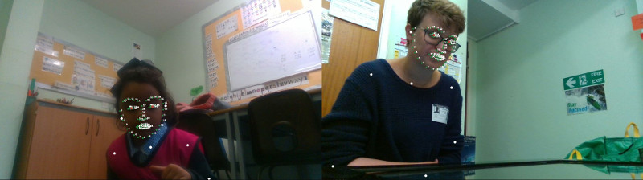

PInSoRo Dataset -- Data Analysis Template App
=============================================

*This project is part of the 'Free-play Sandbox' experimental framework for
Cognitive Human-Robot Interaction research. [Check the PInSoRo
website](https://freeplay-sandbox.github.io/) for details and
[documentation](https://freeplay-sandbox.github.io/analysing)*.





This repository contains well-documented application skeletons to run analysis
on the PInSoRo dataset.

You can use them as starting points for your own applications.

**Currently, only one skeleton is available, for video analysis**. More to come
(please open an
[issue](https://github.com/freeplay-sandbox/analysis-templates/issues) if you
have specific needs).

Pre-requisites for all the templates
------------------------------------

1. You need to **install Ubuntu 16.04** (we do **not** recommend using a virtual
   machine as the performances will not be satisfactory and some applications
   require native access to a GPU)
1. [Install ROS](http://wiki.ros.org/ROS/Installation) (Kinetic or Lunar)
1. Depending on your ROS distribution, install the `ros-kinetic-desktop` or
   `ros-lunar-desktop` package:
```sh
sudo apt install ros-kinetic-desktop # or ros-lunar-desktop
```
1. Open a terminal and install the following additional packages:
```sh
sudo apt install git build-essential cmake
```
1. Create a `src/` directory and clone this repository:
```sh
cd ~ && mkdir src
cd src
git clone https://github.com/freeplay-sandbox/analysis-templates.git
cd analysis-templates
```
1. Compile the templates:
```sh
mkdir build && cd build
cmake ..
make
```

Video analysis
--------------


The [video analysis template](src/video_analysis.cpp) shows how to:
* open a bag file
* access the compressed RGB frames for the 2 front cameras
* access the pre-processed poses file
* use the pose file to plot the location of the facial landmarks, skeleton
  features and hand features

Once compiled (cf above), you can run it from the `build/` directory:
```sh
./devel/lib/freeplay_sandbox_analysis_template/video_analysis <path to one recording>
```


